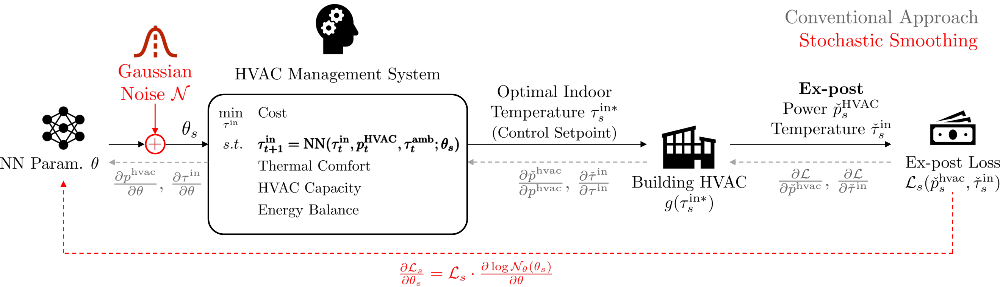

# Decision-Focused Learning (DFL) for HVAC Scheduling
This repository contains code for implementing Decision-Focused Learning (DFL) to optimize HVAC scheduling in buildings.
The DFL approach is used to learn a machine learning proxy (i.e., a neural network) that models the thermal dynamics of the building,
which serves as a constraint in the day-ahead HVAC scheduling process.



The paper associated with this code is:
https://arxiv.org/abs/2506.19717

## Requirements
### EnergyPlus
To run the code, you need to have EnergyPlus 22-1-0 installed and set up on your system.
Please follow the installation instructions on the [EnergyPlus website](https://energyplus.net/downloads).
### Python
The code was run on Python 3.11.
### Packages
You can install the required Python packages using the requirements.txt file:
```bash
pip install -r requirements.txt
```

## Tutorial
### Overview of the code structure
The code contains three main components:
1. **Data Generation**: This part generates synthetic data for the building's thermal dynamics using EnergyPlus.
2. **Model Pre-Training**: This part trains a machine learning model to predict the building's thermal dynamics based on the generated data.
3. **Decision-Focused Learning**: This part integrates the trained model into the HVAC scheduling process to optimize energy usage.
### Paper Results
To reproduce the results from the paper, you can run the following script:
```bash
python PaperResults.py
```
The tables of the paper can be found in 'output' folder.

### More results
Below is a step-by-step guide to generate your own results.

1. **Data Generation**: The GenerateDatasets.py script generates the Excel file by simulating one year of data for the building.
   - Make sure to have EnergyPlus installed and set up correctly.
   - The script will generate datasets containing the building's thermal dynamics data.
   - You can find the generated Excel file in the `data/SmallOffice/Output-6zones_ASHRAE901_OfficeSmall_STD2022_Denver_YYYY-YYYY` directory.
2. **Model Pre-Training**: The IndoorTemperatureModelling.py script trains a neural network (NN) or RC model that predicts the building's thermal dynamics.
   - The script will read the generated datasets and train the model.
   - The trained model will be saved in the `data/SmallOffice/Models` directory.
3. **Clustering**: The src.library.main_clustering function identifies clusters in the data.
4. **Decision-Focused Learning**:
   - Enter the desired hyperparameters in `create_parameter_list` function in `DFLoptiTaskAndParams.py`.
   - This script will use the trained model as a constraint in the HVAC scheduling process.
   - The results will be saved in the `Models\cvxpylayer` directory.

All the steps are automated in the `RunDFLopti.py` script.
```bash
python RunDFLopti.py
```

## License
This project is licensed under the MIT License. See the [LICENSE](LICENSE) file for details.